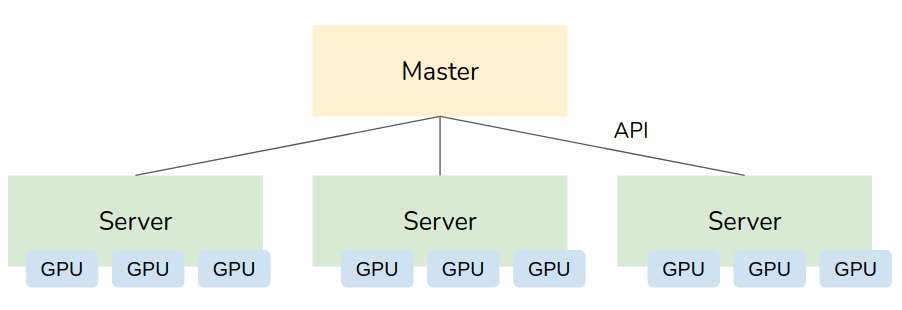

To monitor RAM and GPU usage on multiple servers. 

In a computer science lab or company, you usually have multiple servers and GPUs running many deep learning experiments. You want to know which device is working and which is available at a glance with a minimum setup.

## Screenshots


## Installation

```shell
git clone https://github.com/kehanlu/server-monitor
cd server-monitor
pip install -r requirements.txt
```

- `nvidia-smi`: https://www.nvidia.com


## Usage



### Server

"Server" means the server you want to monitor.

1. Go to server you want to monitor
    - You have to be sure that `nvidia-smi` command is installed.

2. run the command to start an API.

```shell
gunicorn -w 1 -k uvicorn.workers.UvicornWorker -b 0.0.0.0:23333 server:app --daemon
```

### Master

"Master" means the web server which is going to fetch data from each servers. You can run this web server on any computer. In some case, you might want this web server to be accessible from public network, but still hide servers behind a firewall.

1. create a file named `config.py`

2. In `config.py`, you need to have a list of server ips. Then the web server will iterate from the list and GET the API at `http://{ip}:23333`.

- `server_ips`
- `site_title(optional)`: the title of website
- `top_message(optional)`: the message shows on the top

```python
CONFIG = {
    "site_title": "Server status",
    "top_message": "Hello world",
    "server_ips": [
        "192.168.0.2",
        "192.168.0.3",
        "192.168.0.4",
    ],
}

```

3. run the command to start the server.

```shell
gunicorn -w 1 -b 0.0.0.0:8787 master:app
```

4. Visit `127.0.0.1:8787` or `<your_ip>:8787` to see the website.

## Contribution

Pull requests are welcome. This is still an early project (and just for fun).

TODOs:

- Autorefresh
